# 🌐 My Portfolio - [https://busiristheo.com](https://busiristheo.com)

My first Epitech project is a responsive website made in 2 days. 
Think of it as a mix between a CV, digital resume & portfolio
Made in React with Next.js !  

## 🧾 License
This code is published for demonstration purposes only.  
© 2025 Théo Busiris — **All rights reserved.**

## ⚙️ Tech Stack

- Next.js
- React (jsx)
- Hébergement : Vercel

## 📬 Contact

- Email pro : [contact@busiristheo.com](contact@busiristheo.com)
- LinkedIn : [linkedin.com/in/theobusiris](https://linkedin.com/in/theobusiris)
- GitHub : [github.com/MXXR-Fivem](https://github.com/MXXR-Fivem)

## ▶️ Run Locally

1. Clone the repo and go into the folder : 
```bash
git clone https://github.com/MXXR-Fivem/Digital-Resume-Theo-Busiris.git
cd Digital-Resume-Theo-Busiris
```
2. Install dependencies :
```bash
npm install
# or
yarn install
```
3. Start the development server :
```bash
npm run dev
# or
yarn dev
```
4. Open http://localhost:3000 in your browser.

## 🔎 Preview

Below are screenshots showing the site on different device sizes.

### Phone

<p align="left">
	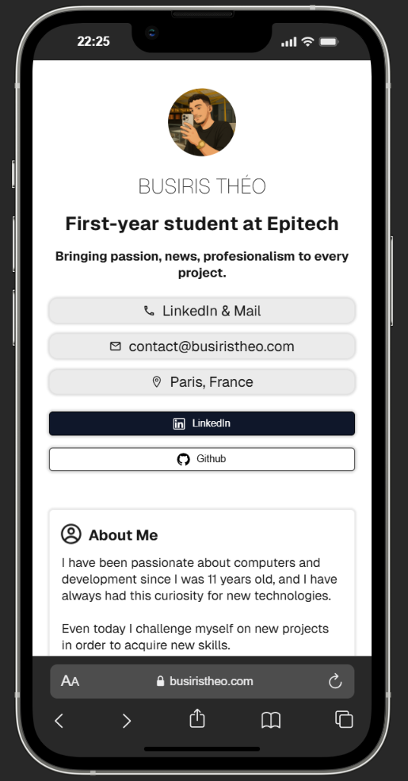
	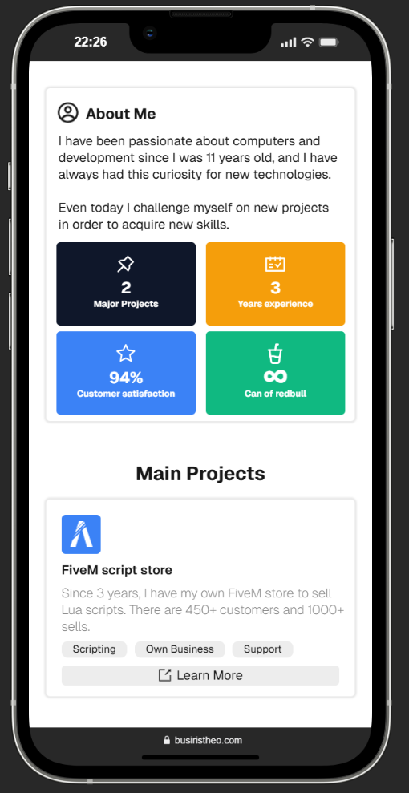
	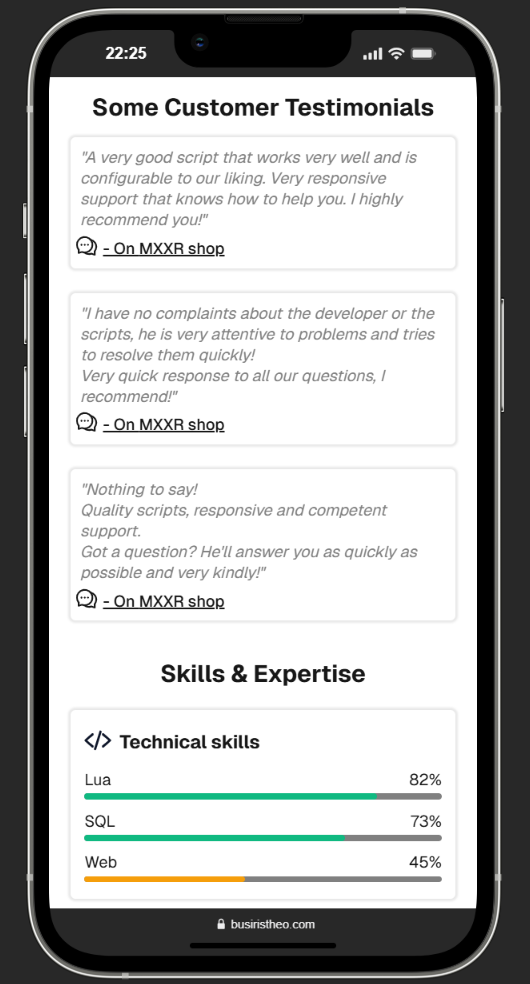
    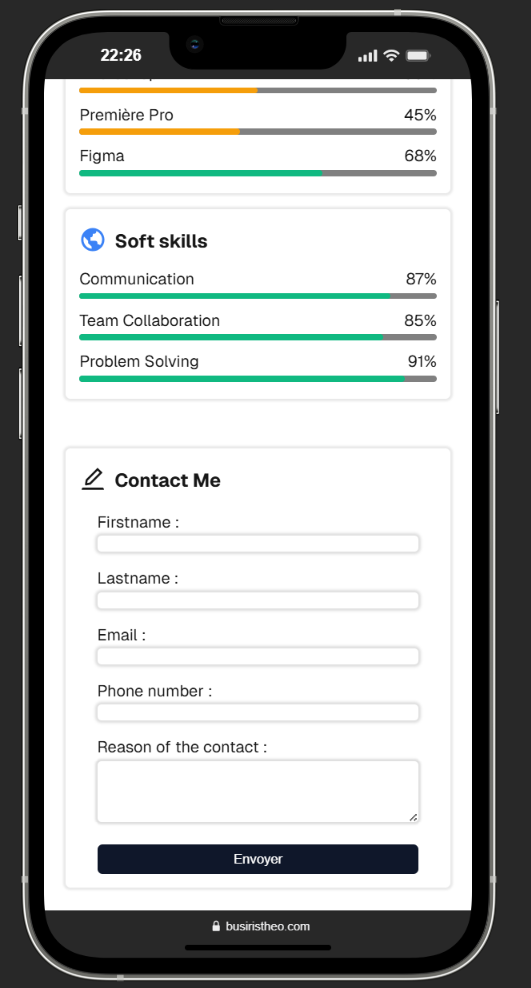
</p>

### Tablet

<p align="left">
	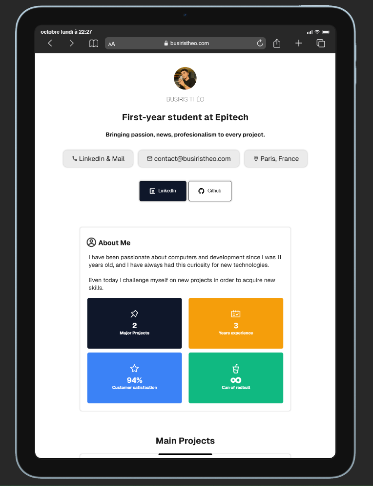
	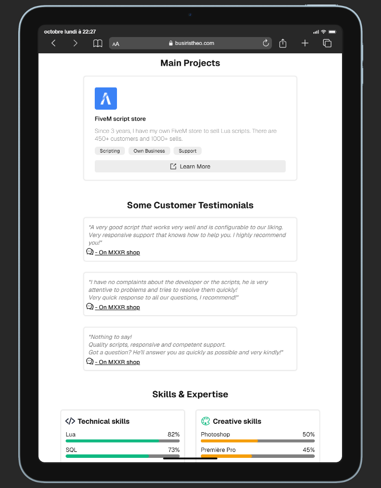
	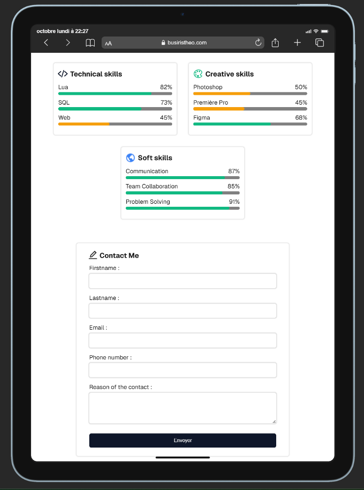
</p>

### Computer

<p align="left">
	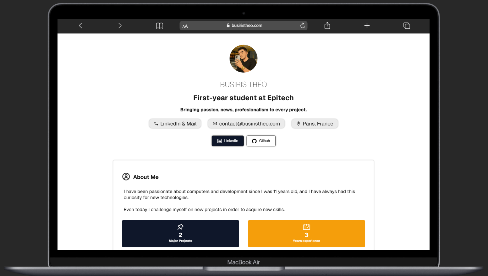
	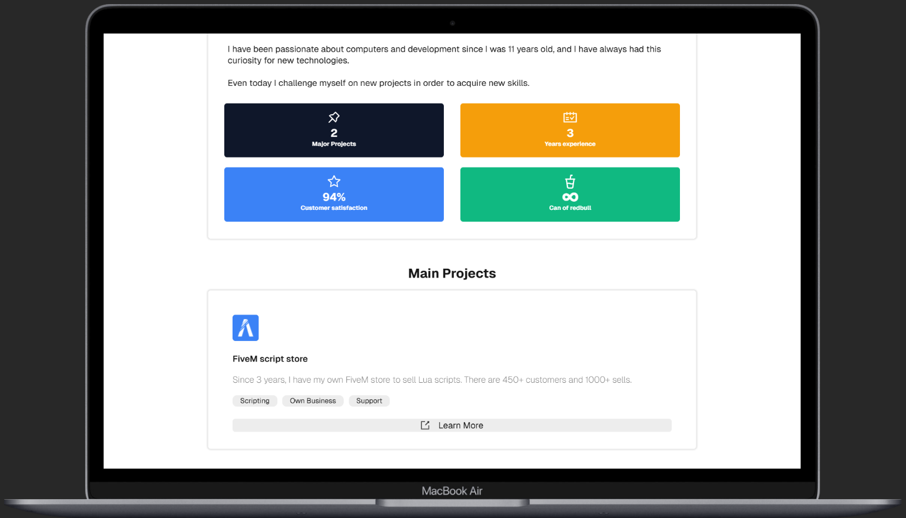
	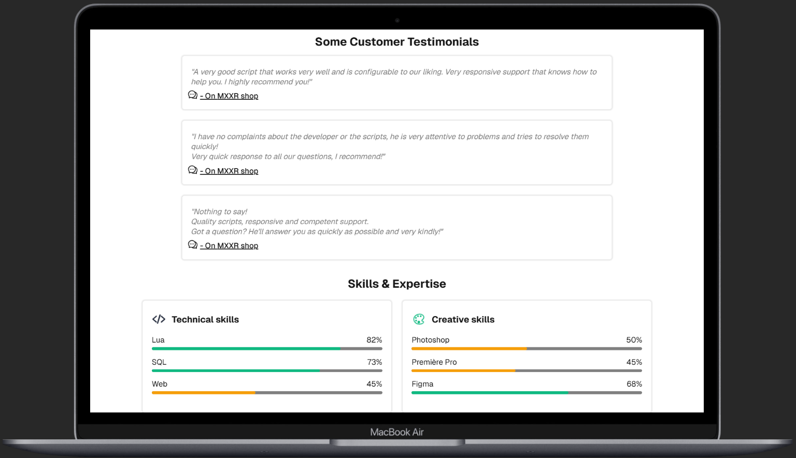
    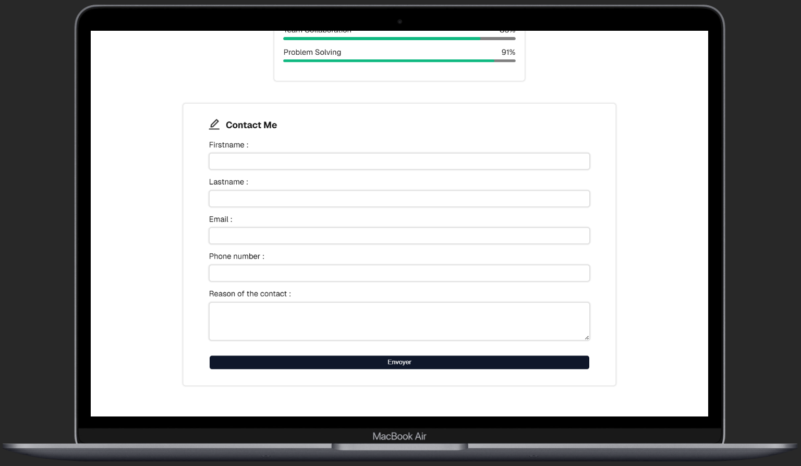

</p>


